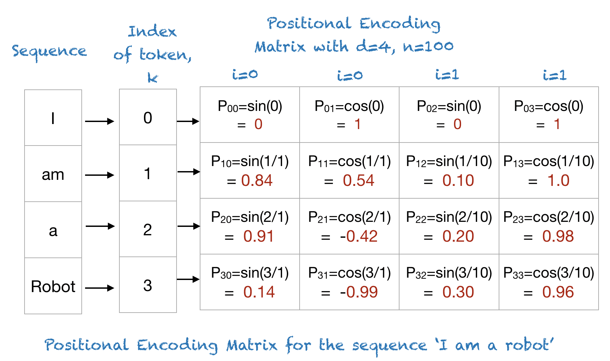

# Resources :
- [Generative AI with Large Language Models | Coursera](https://www.coursera.org/learn/generative-ai-with-llms)

# Notes

## L1 : Generative AI and LLMs

- **Foundation models :**
	- BERT
	- GPT
	- LLaMa
	- FLAN-T5
	- BLOOM
	- PaLM

### Prompts and completions
- LLMs take human written instructions and perform tasks
- The text that you pass to an LLM is known as a **==prompt==**
- The space or memory that is available to the prompt is called the ==**context window**== (typically a few 1000 words)
- The output of the model is called a **==completion==**
	- The completion is comprised of the text contained in the original prompt, followed by the generated text
	
```
PROMPT : Which is the capital of Bulgaria?
COMPLETION: The capital of Bulgaria is Sofia
```

- The act of using the model to generate text is known as **==inference==**


#### Example : prompts and completions


*The prompt is passed to the model, the model then predicts the next words, and generates an answer*

## L2 : Tasks and use cases

- **Language translation**
- **Write text** (e.g. essay) based on a prompt
- **Document summarization** when you provide a document together with the prompt
- **Translate natural language to machine code** (write python code)
- **Entity extraction** (e.g. identify all people and places from a text) - Named Entity Recognition (NER)
- **Augmenting LLMs by connecting them to external data sources**

## L3 : Foundation of the transformers 

- [2017 - Attention Is All You Need](https://arxiv.org/abs/1706.03762)
	- Origin of the transformers architecture
		- Scale efficiently
		- Parallel process
		- Attention to input meaning

> 	The dominant sequence transduction models are based on complex recurrent or convolutional neural networks in an encoder-decoder configuration. The best performing models also connect the encoder and decoder through an attention mechanism. We propose a new simple network architecture, the Transformer, based solely on attention mechanisms, dispensing with recurrence and convolutions entirely. Experiments on two machine translation tasks show these models to be superior in quality while being more parallelizable and requiring significantly less time to train. Our model achieves 28.4 BLEU on the WMT 2014 English-to-German translation task, improving over the existing best results, including ensembles by over 2 BLEU. On the WMT 2014 English-to-French translation task, our model establishes a new single-model state-of-the-art BLEU score of 41.8 after training for 3.5 days on eight GPUs, a small fraction of the training costs of the best models from the literature. We show that the Transformer generalizes well to other tasks by applying it successfully to English constituency parsing both with large and limited training data.

## L4 : Transformers architecture

[Transformers architecture | Coursera](https://www.coursera.org/learn/generative-ai-with-llms/lecture/3AqWI/transformers-architecture)

### ==Transformers==
- **Early RNN implementations :**
	- Learn the relevance and context to each word next to its neighbor.
	- 

- **Transformers**
	- The power in the transformer architecture lies in its **ability to learn the relevance and context of all of the words in a sentence**
	- 


### ==Attention weights==

- 

- Transformers apply attention weights to those relationships so that the model learns the relevance of each word to each other words no matter where they are in the input.

- This gives the algorithm the ability to learn **who has the book**, *who could have the book*, and if it's even relevant to the wider context of the document.

### ==Attention map==


### ==Self-attention==

- The word book is strongly connected with or paying attention to the word teacher and the word student. 

- This is called **self-attention** and the ability to learn a tension in this way across the whole input significantly approves the model's ability to encode language

- 

### ==Transformer architecture==

#### **Architecture**
- 

#### ==**Simplified diagram**==
- 

- The transformer architecture is split into two distinct parts, the encoder and the decoder.

- These components work in conjunction with each other, and they share a number of similarities.

#### ==**Steps**==

- 

- 

- 
- 

- **==Read the following article for an introduction to the positional encoding matrix==**
	- [A Gentle Introduction to Positional Encoding in Transformer Models](https://machinelearningmastery.com/a-gentle-introduction-to-positional-encoding-in-transformer-models-part-1/)


	- The following table shows the positional encoding matrix for phrase “I am a robot,” with n=100 and d=4. T 
	- 

**TODO:**

- Guide to understand the positional encoding : [Positional Encoding. This article is the second in The… | by Hunter Phillips | Medium](https://medium.com/@hunter-j-phillips/positional-encoding-7a93db4109e6)

# Tags 
#LLMs, #prompt, #context_window, #completion, #inference, #transformers, #attention_weights, #attention_map, #embedding, #tokenization, #encoder, #decoder, #positonal_encoding, #positonal_encoding_matrix, #sine, #cosine 
