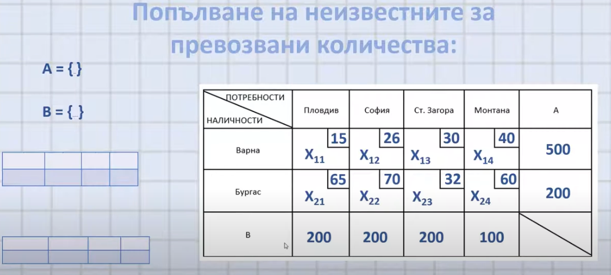

# Notes

- транспортна матрица
	- Вектор на наличностите ( ?? )
	- Вектор на потребностите ( ?? )
	- Матрица на разходите (**ще я измерим във време**).
		- Колко време отнема да отидем от продукт XYZ до продукт QWE, POR, ZMS
	- Матрица за търсен план на презова ( ?? )

	- 
# Links
- [Транспортна задача (youtube.com)](https://www.youtube.com/watch?v=BrZrrs_e32U)
- [LInear programming Notes : The Transportation problem](https://econweb.ucsd.edu/~jsobel/172aw02/notes8.pdf)

