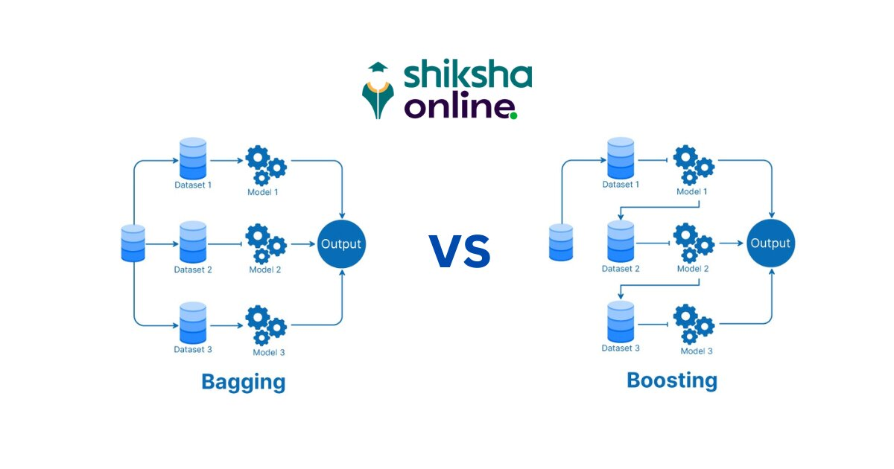

**Resources :** 
- [Difference Between Bagging and Boosting - Shiksha Online](https://www.shiksha.com/online-courses/articles/bagging-and-boosting/#:~:text=Bagging%20and%20boosting%20are%20different,made%20by%20the%20previous%20model.)

  - 
# **Difference Between Bagging and Boosting: Bagging vs Boosting**

|                       | **Bagging**                                                    | **Boosting**                                                                                                             |
| --------------------- | -------------------------------------------------------------- | ------------------------------------------------------------------------------------------------------------------------ |
| **Basic Concept**     | Combines multiple models trained on different subsets of data. | Train models sequentially, focusing on the error made by the previous model.                                             |
| **Objective**         | To reduce variance by averaging out individual model error.    | Reduces both bias and variance by correcting misclassifications of the previous model.                                   |
| **Data Sampling**     | Use Bootstrap to create subsets of the data.                   | Re-weights the data based on the error from the previous model, making the next models focus on misclassified instances. |
| **Model Weight**      | Each model serves equal weight in the final decision.          | Models are weighted based on accuracy, i.e., better-accuracy models will have a higher weight.                           |
| **Error Handling**    | Each model has an equal error rate.                            | It gives more weight to instances with higher error, making subsequent model focus on them.                              |
| **Overfitting**       | Less prone to overfitting due to average mechanism.            | Generally not prone to overfitting, but it can be if the number of the model or the iteration is high.                   |
| **Performance**       | Improves accuracy by reducing variance.                        | Achieves higher accuracy by reducing both bias and variance.                                                             |
| **Common Algorithms** | Random Forest                                                  | AdaBoost, XGBoost, Gradient Boosting Mechanism                                                                           |
| **Use Cases**         | Best for high variance, and low bias models.                   | Effective when the model needs to be adaptive to errors, suitable for both bias and variance errors.                     |