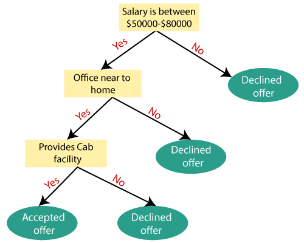
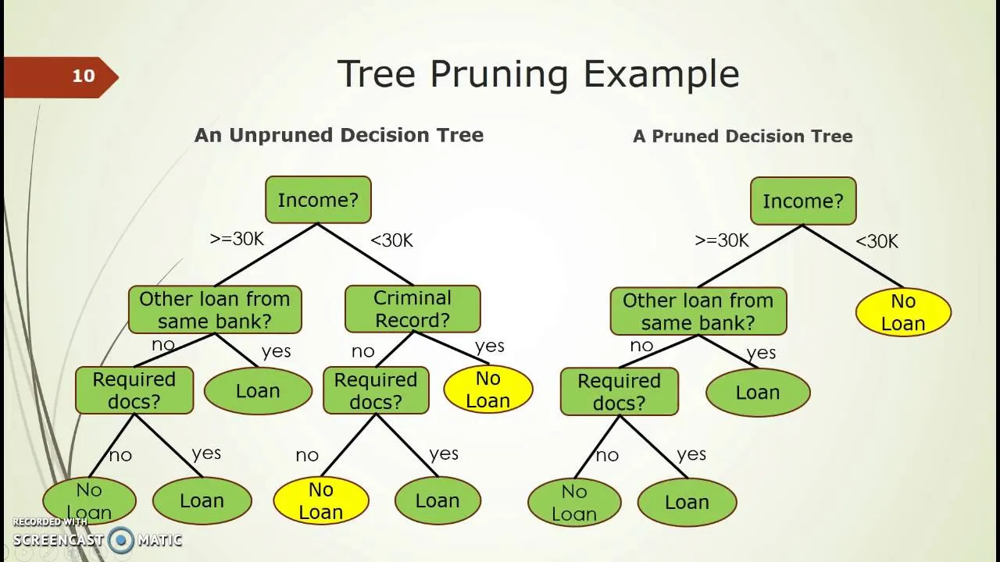

# Resources 

- [GitHub - Devinterview-io/light-gbm-interview-questions: 🟣 LightGBM interview questions and answers to help you prepare for your next machine learning and data science interview in 2024.](https://github.com/Devinterview-io/light-gbm-interview-questions)

# Decision Trees main components

- [Decision Tree Algorithm in Machine Learning - Javatpoint](https://www.javatpoint.com/machine-learning-decision-tree-classification-algorithm)

	- **Root Node:** Root node is from where the decision tree starts. It represents the entire dataset, which further gets divided into two or more homogeneous sets.
	- **Leaf Node:** Leaf nodes are the final output node, and the tree cannot be segregated further after getting a leaf node.
	- **Splitting:** Splitting is the process of dividing the decision node/root node into sub-nodes according to the given conditions.
	- **Branch/Sub Tree:** A tree formed by splitting the tree.
	- **Pruning:** Pruning is the process of removing the unwanted branches from the tree.
	- **Parent/Child node:** The root node of the tree is called the parent node, and other nodes are called the child nodes.
- **Examples :**
	- - 

**Attribute selection measure or ASM**
	- **Information Gain**
		- [A Simple Explanation of Information Gain and Entropy - victorzhou.com](https://victorzhou.com/blog/information-gain/)
		- **Information Entropy** can be thought of as how unpredictable a dataset is.
			- A set of only one class (**say, blue** ) is extremely predictable: anything in it is blue. This would have **low entropy**.
			- A set of many mixed classes  is unpredictable: a given element could be any color! This would have **high entropy**.
			- 💡 The lower the value the better (A dataset of only one color (blue),  would have very **low** (in fact, zero) entropy.)
	- **Gini Index** 
		- [Gini Impurity – LearnDataSci](https://www.learndatasci.com/glossary/gini-impurity/)
			- 💡An attribute with the smallest Gini Impurity is selected for splitting the node.

- **Pruning: Getting an Optimal Decision tree**
	- _Pruning is a process of deleting the unnecessary nodes from a tree in order to get the optimal decision tree._
	-  

# Main components : 

- [How gradient boosting works](https://github.com/Devinterview-io/light-gbm-interview-questions?tab=readme-ov-file#how-gradient-boosting-works)
- **Leaf-Wise Tree Growth**: Unlike other methods that grow trees level-wise, LightGBM chooses the leaf that leads to the most significant decrease in the loss function. May lead to overfitting if not properly regulated, particularly in shallower trees.
	- Favors data samples leading to large information gains**
		- **Concerns**: The strategy risks overfitting or ignoring less contributing data.
		- **Addressed**: LightGBM features mechanisms like `max-depth` control, minimum data points needed for a split, and leaf-wise technique subsampling.
- https://www.researchgate.net/publication/321766964/figure/fig2/AS:11431281211892503@1702502449355/Illustration-of-level-wise-and-leaf-wise-tree-growth-approaches-for-gradient-boosted.tif
# Examples :

- [LightGBM/examples/python-guide at master · microsoft/LightGBM · GitHub](https://github.com/microsoft/LightGBM/tree/master/examples/python-guide)
- [LightGBM: A Highly-Efficient Gradient Boosting Decision Tree - KDnuggets](https://www.kdnuggets.com/2020/06/lightgbm-gradient-boosting-decision-tree.html)
- [Bedeutung und Visualisierung der LightGBM-Funktionen - GeeksforGeeks](https://www.geeksforgeeks.org/lightgbm-feature-importance-and-visualization/)
- [Non-deterministic even with "deterministic=True" "seed=0" and the same number of threads in LightGBM==3.1.1 · Issue #3761 · microsoft/LightGBM · GitHub](https://github.com/microsoft/LightGBM/issues/3761)

# Tags
#gradient_descent , #pruning , #ASM, #entropy , #gini-index , #InformationGain , #InformationEntropy, 